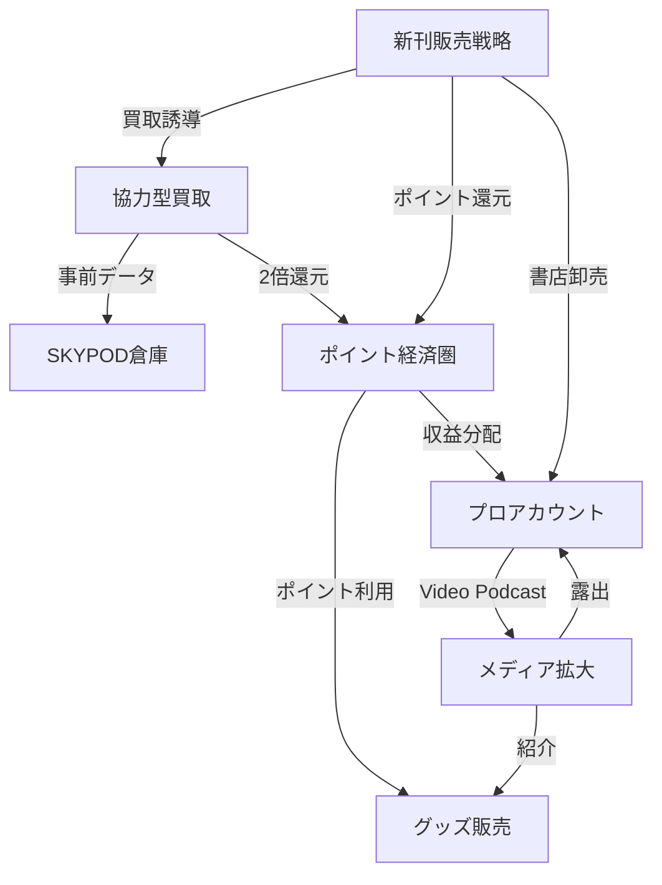

# 📚 バリューブックス2026 戦略INDEX

> [!abstract] このページについて
> バリューブックス2026年の全戦略を俯瞰するMOC（Map of Content）です。
> 各プロジェクトへのリンク、関連性、進捗状況を一元管理します。

## 🎯 全体ビジョン

**「簡単なのに高い」二次流通 × ポイント経済圏 × メディアの力**

- [[00_全体戦略_みんなの作戦会議ノート]]
- [[00_開発原則_全体ルール]]

---

## 🗂️ 7つの主要プロジェクト

### 1️⃣ [[プロジェクト_01_協力型買取|協力型買取（本棚スキャン）]]

**タグ:** #AI #買取 #協力型 #MVP
**ステータス:** 🔴 最優先
**開始予定:** 2026年Q1

```dataview
TABLE status as "状態", kpi as "目標KPI"
WHERE contains(file.tags, "協力型買取")
```

**関連プロジェクト:**
- → [[プロジェクト_04_SKYPOD倉庫]] (検品データ連携)
- → [[プロジェクト_02_ポイント経済圏]] (2倍還元)

---

### 2️⃣ [[プロジェクト_02_ポイント経済圏|ポイント経済圏]]

**タグ:** #ポイント #LTV #循環経済
**ステータス:** 🟡 重要
**開始予定:** 2026年Q1

**関連プロジェクト:**
- → [[プロジェクト_01_協力型買取]] (ポイント2倍還元)
- → [[プロジェクト_03_グッズ販売]] (ポイント交換先)
- → [[プロジェクト_05_プロアカウント]] (収益シェア)

---

### 3️⃣ [[プロジェクト_03_グッズ販売|本のある暮らしグッズ]]

**タグ:** #グッズ #コラボ #BCorp #Shopify
**ステータス:** 🟢 通常
**開始予定:** 2026年Q1

**コラボ先:**
- 丸山珈琲（軽井沢）
- Minimal（チョコ）
- ヤッホーブルーイング
- IKEUCHI ORGANIC（B Corp）

**関連プロジェクト:**
- → [[プロジェクト_02_ポイント経済圏]] (ポイント利用)
- → [[プロジェクト_06_メディア拡大]] (動画で紹介)

---

### 4️⃣ [[プロジェクト_04_SKYPOD倉庫|SKYPOD倉庫革命]]

**タグ:** #自動化 #SKYPOD #効率化 #投資
**ステータス:** 🔴 最優先
**開始予定:** 2026年Q2

**投資額:** ¥61,000,000
**回収期間:** 5〜10年

**関連プロジェクト:**
- ← [[プロジェクト_01_協力型買取]] (事前データ活用)

---

### 5️⃣ [[プロジェクト_05_プロアカウント|プロアカウント]]

**タグ:** #エコシステム #パートナー #Retool
**ステータス:** 🟡 重要
**開始予定:** 2026年Q2

**ターゲットパートナー:**
- ゆる言語学ラジオ（成功モデル）
- 本屋B&B（成功モデル）
- 著者・出版社・書店（10組）

**関連プロジェクト:**
- → [[プロジェクト_06_メディア拡大]] (Video Podcast)
- → [[プロジェクト_02_ポイント経済圏]] (収益分配)

---

### 6️⃣ [[プロジェクト_06_メディア拡大|メディア拡大]]

**タグ:** #YouTube #メディア #コンテンツ #編集ギルド
**ステータス:** 🟡 重要
**開始予定:** 2026年Q1

**新チャンネル:**
- Video Podcast
- 著者密着ドキュメンタリー

**関連プロジェクト:**
- → [[プロジェクト_03_グッズ販売]] (動画内紹介)
- → [[プロジェクト_05_プロアカウント]] (パートナー露出)

---

### 7️⃣ [[プロジェクト_07_新刊販売戦略|新刊販売戦略]]

**タグ:** #新刊 #買取CPA #循環型 #楽天 #直取引
**ステータス:** 🔴 最優先
**開始予定:** 2026年Q1

**目標:**
- 1日5,000冊の新刊販売（12ヶ月後）
- 買取CPA 3,000円 → 1,143円
- 出版社3社と直取引

**関連プロジェクト:**
- → [[プロジェクト_05_プロアカウント]] (書店への卸売)
- → [[プロジェクト_02_ポイント経済圏]] (ポイント還元)
- → [[プロジェクト_01_協力型買取]] (買取誘導の強化)

**詳細資料:** [新刊販売戦略フォルダ](../../新刊販売戦略/)

---

## 🔗 プロジェクト関連図



---

## 📊 全体KPI

| 指標 | 現状 | 目標（12ヶ月後） |
|------|------|----------------|
| 月間処理能力 | 30,000冊 | 90,000冊 |
| LTV | ¥10,000 | ¥15,000 |
| YouTube登録者 | ?万人 | 30万人 |
| 月間売上 | - | +¥10,000,000 |

---

## 🗓️ タイムライン

### Q1（1-3月）：仕込み期
- [ ] [[プロジェクト_01_協力型買取]] 開発開始
- [ ] [[プロジェクト_02_ポイント経済圏]] システム設計
- [ ] [[プロジェクト_03_グッズ販売]] コラボ交渉
- [ ] [[プロジェクト_04_SKYPOD倉庫]] 詳細設計
- [ ] [[プロジェクト_07_新刊販売戦略]] 仕入れ先確保・楽天出店準備

### Q2（4-6月）：ローンチ
- [ ] [[プロジェクト_02_ポイント経済圏]] リリース
- [ ] [[プロジェクト_03_グッズ販売]] 第1弾販売
- [ ] [[プロジェクト_01_協力型買取]] β版
- [ ] [[プロジェクト_05_プロアカウント]] 第1号
- [ ] [[プロジェクト_07_新刊販売戦略]] 1日1,000冊達成・Yahoo/メルカリ展開

### Q3（7-9月）：拡大期
- [ ] [[プロジェクト_04_SKYPOD倉庫]] 本格稼働
- [ ] [[プロジェクト_06_メディア拡大]] Video Podcast開始
- [ ] [[プロジェクト_01_協力型買取]] 正式リリース
- [ ] [[プロジェクト_07_新刊販売戦略]] 1日5,000冊達成・出版社直取引交渉

### Q4（10-12月）：総まとめ
- [ ] 成功事例の発信
- [ ] 全施策レビュー
- [ ] 2027年戦略策定

---

## 🏷️ タグ体系

### プロジェクトタイプ
- #技術開発 - AI、システム開発
- #事業開発 - ビジネスモデル、パートナーシップ
- #マーケティング - メディア、コンテンツ

### 優先度
- #最優先 - 今すぐ着手
- #重要 - Q1-Q2に着手
- #検討中 - Q3以降

### 技術スタック
- #Flutter #Python #Go #Shopify #Retool #SKYPOD

---

## 📂 関連ドキュメント

### 作戦ノート（カジュアル版）
- [[01_ポイント経済圏_作戦ノート]]
- [[02_本のある暮らしグッズ_作戦ノート]]
- [[03_SKYPOD倉庫革命_作戦ノート]]
- [[04_本棚スキャン_作戦ノート]]
- [[05_プロアカウント_作戦ノート]]
- [[06_メディア拡大_作戦ノート]]
- [[07_新刊販売戦略_作戦ノート]]

### 技術詳細
- [[07_協力型買取_完全ガイド]]
- [[00_開発原則_全体ルール]]
- [[プロジェクトシート_テンプレート]]

---

## 🔍 クイックリンク

- [トップページ](index.html)
- [全体戦略HTML](00_全体戦略_みんなの作戦会議ノート.html)
- 技術詳細: [[07_協力型買取_完全ガイド]]

---

## 📝 更新履歴

- 2026-01-06: INDEX作成
- 進捗状況を週次で更新予定

---

> [!tip] Obsidianの使い方
> - グラフビューで各プロジェクトの関連性を可視化
> - タグ検索で特定技術・優先度でフィルタリング
> - Dataviewプラグインでダッシュボード作成可能

