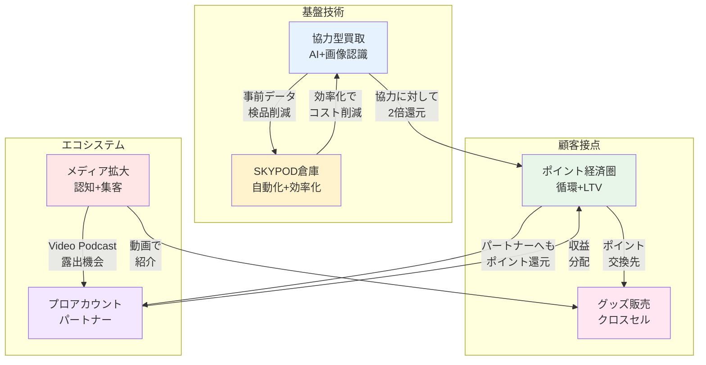
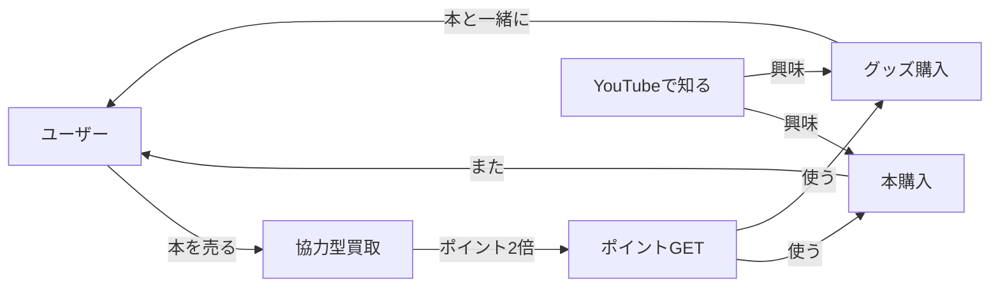
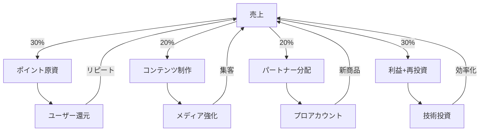
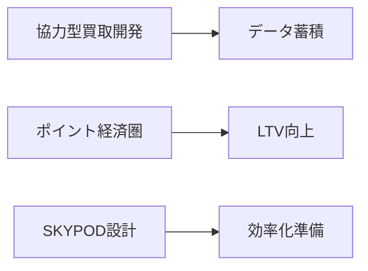
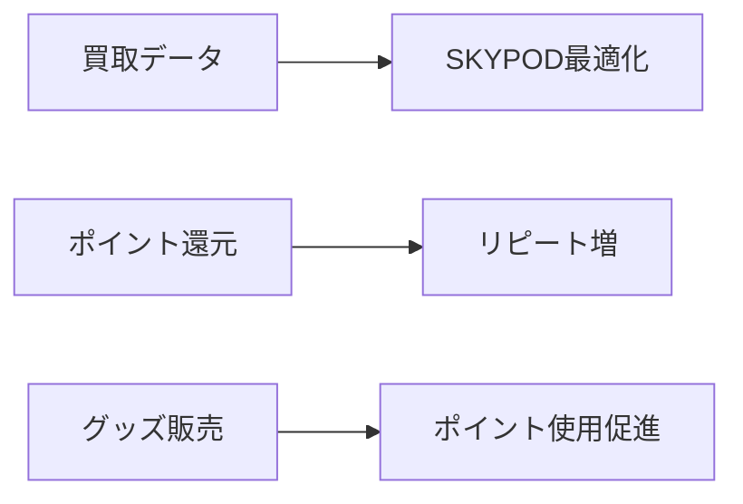
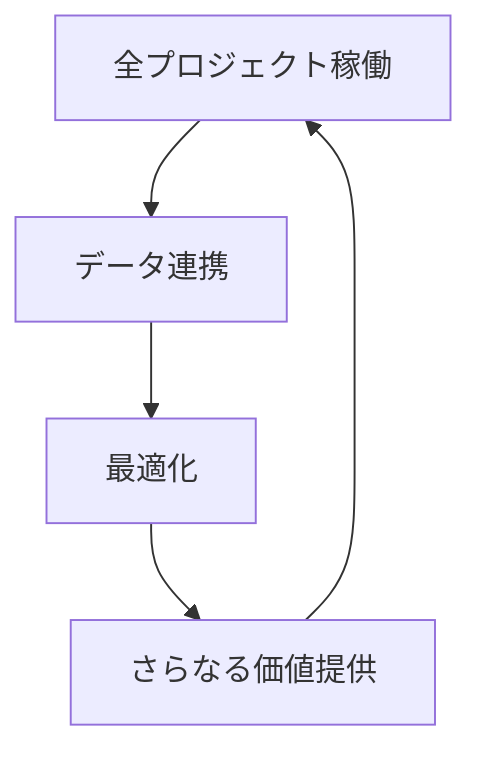
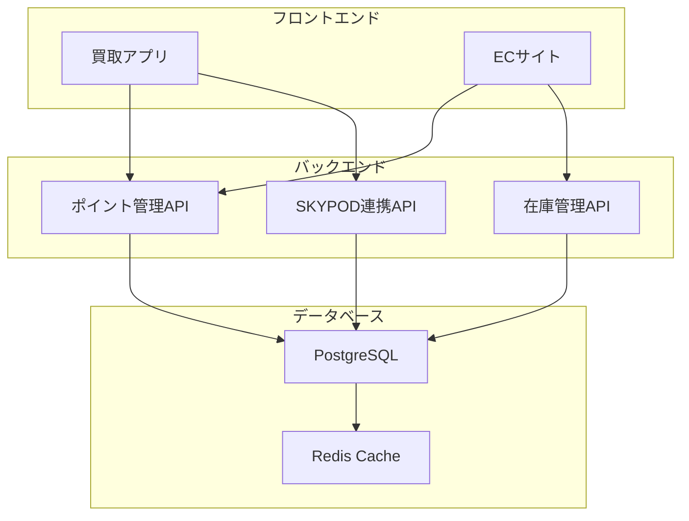

# 🗺️ プロジェクト関連マップ

> [!info] このページについて
> 6つのプロジェクトがどのように繋がり、相乗効果を生み出すかを可視化します。

---

## 📊 全体構造図



---

## 🔄 循環フロー

### 📚 ユーザー視点の循環



### 💰 収益の循環



---

## 🎯 プロジェクト別：依存関係

### [[プロジェクト_01_協力型買取]]

**🔼 これに依存:**
- [[プロジェクト_04_SKYPOD倉庫]] - 事前データを活用して検品効率化

**🔽 これが依存:**
- [[プロジェクト_02_ポイント経済圏]] - 協力へのインセンティブ（2倍還元）

**相乗効果:**
- ユーザーが協力 → データ蓄積 → SKYPODが賢くなる → 検品削減 → 買取価格UP → さらに協力者増

---

### [[プロジェクト_02_ポイント経済圏]]

**🔼 これに依存:**
なし（独立して機能）

**🔽 これが依存:**
- [[プロジェクト_01_協力型買取]] - 2倍還元の原資
- [[プロジェクト_03_グッズ販売]] - ポイント交換先
- [[プロジェクト_05_プロアカウント]] - パートナーへの分配

**相乗効果:**
- ポイント → 使い道が多い → 魅力UP → 受取率UP → 循環加速

---

### [[プロジェクト_03_グッズ販売]]

**🔼 これに依存:**
- [[プロジェクト_02_ポイント経済圏]] - ポイント利用先として
- [[プロジェクト_06_メディア拡大]] - 動画で紹介

**🔽 これが依存:**
なし

**相乗効果:**
- 動画紹介 → グッズ売上UP → コラボ拡大 → さらに魅力的な商品

---

### [[プロジェクト_04_SKYPOD倉庫]]

**🔼 これに依存:**
- [[プロジェクト_01_協力型買取]] - 事前データで検品削減

**🔽 これが依存:**
なし（単独でも効果）

**相乗効果:**
- 処理能力3倍 → 買取受入れ拡大 → 売上UP → 投資回収加速

---

### [[プロジェクト_05_プロアカウント]]

**🔼 これに依存:**
- [[プロジェクト_06_メディア拡大]] - Video Podcastで露出
- [[プロジェクト_02_ポイント経済圏]] - 収益分配

**🔽 これが依存:**
なし

**相乗効果:**
- パートナー成功 → 成功事例 → 新規パートナー → エコシステム拡大

---

### [[プロジェクト_06_メディア拡大]]

**🔼 これに依存:**
なし（独立して機能）

**🔽 これが依存:**
- [[プロジェクト_03_グッズ販売]] - 紹介コンテンツ
- [[プロジェクト_05_プロアカウント]] - パートナーとのコラボ

**相乗効果:**
- 認知UP → 全プロジェクトに波及 → さらに面白いコンテンツ作成可能

---

## 🎨 価値の流れ

### ユーザーへの価値提供

```
[協力型買取]
    ↓ 高く買取
[ユーザー満足]
    ↓ ポイント選択
[ポイント経済圏]
    ↓ 多様な使い道
[グッズ/本購入]
    ↓ 良い体験
[リピート]
```

### パートナーへの価値提供

```
[プロアカウント]
    ↓ 高収益直販
[パートナー満足]
    ↓ Video Podcast出演
[メディア拡大]
    ↓ 認知UP
[さらに売上UP]
```

---

## 📈 成長のサイクル

### Phase 1: 基盤構築（Q1-Q2）



### Phase 2: 相乗効果（Q2-Q3）



### Phase 3: エコシステム完成（Q3-Q4）



---

## 🔗 技術的な連携ポイント

### API連携

| 連携元 | 連携先 | データ | 目的 |
|--------|--------|--------|------|
| 協力型買取 | SKYPOD倉庫 | 書籍状態、ユーザー信頼度 | 検品レーン振り分け |
| 協力型買取 | ポイント経済圏 | 買取ID、ミッション達成 | ポイント2倍付与 |
| グッズ販売 | ポイント経済圏 | 購入履歴 | ポイント利用 |
| プロアカウント | ポイント経済圏 | 売上データ | 収益分配 |

### データフロー



---

## 💡 シナジー分析

### 強い相乗効果（★★★）

1. **協力型買取 × SKYPOD倉庫**
   - データ連携で検品75%削減
   - コスト削減分を買取価格に還元
   - さらに協力者が増える好循環

2. **ポイント経済圏 × 全プロジェクト**
   - すべての行動をポイントで繋ぐ
   - LTV最大化の中核

3. **メディア拡大 × グッズ販売**
   - 動画で紹介 → 即購入導線
   - ストーリーテリングで差別化

### 中程度の相乗効果（★★☆）

1. **プロアカウント × メディア拡大**
   - Video Podcastで露出
   - 成功事例のコンテンツ化

2. **グッズ販売 × ポイント経済圏**
   - ポイント交換先の拡充
   - クロスセル促進

### 今後期待する相乗効果（★☆☆）

1. **協力型買取 × メディア拡大**
   - AI技術のストーリー化
   - 「こんなに高く売れた！」体験談

---

## 🎯 目指す姿（2026年末）

```
        [メディア] 30万登録者
             ↓
        [認知・集客]
             ↓
    ┌────────┴────────┐
    │                    │
[買取] 高価格      [販売] グッズ+本
    │                    │
    └────→ [ポイント] ←─┘
             ↓
        [リピート]
             ↓
      [エコシステム完成]
```

---

## 📝 次のアクション

### チーム横断で確認すべきこと

- [ ] API仕様の統一
- [ ] データフォーマットの標準化
- [ ] エラーハンドリングの共通化
- [ ] モニタリング・ログ設計

### 定期的な見直し

- [ ] 月次：各プロジェクトの進捗確認
- [ ] 四半期：相乗効果の検証
- [ ] 半期：戦略の見直し

---

> [!tip] Obsidianでの活用
> - グラフビューでこのページを中心に関連性を確認
> - 各プロジェクトページから [[01_プロジェクト関連マップ]] にリンク
> - Mermaid図をプレビューで可視化

